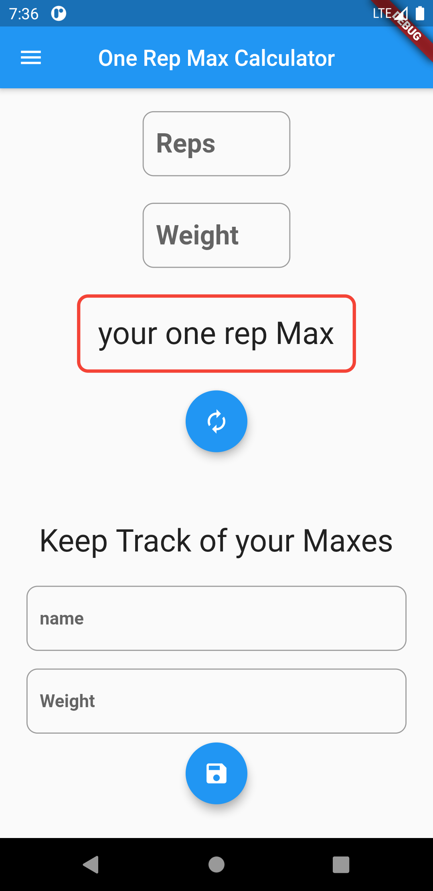
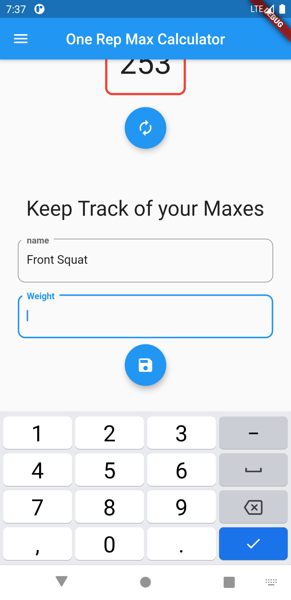
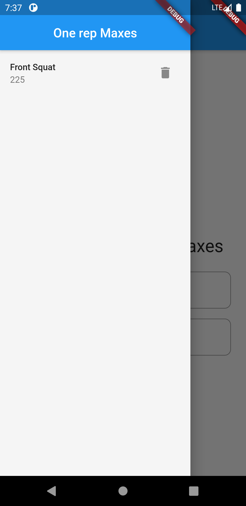
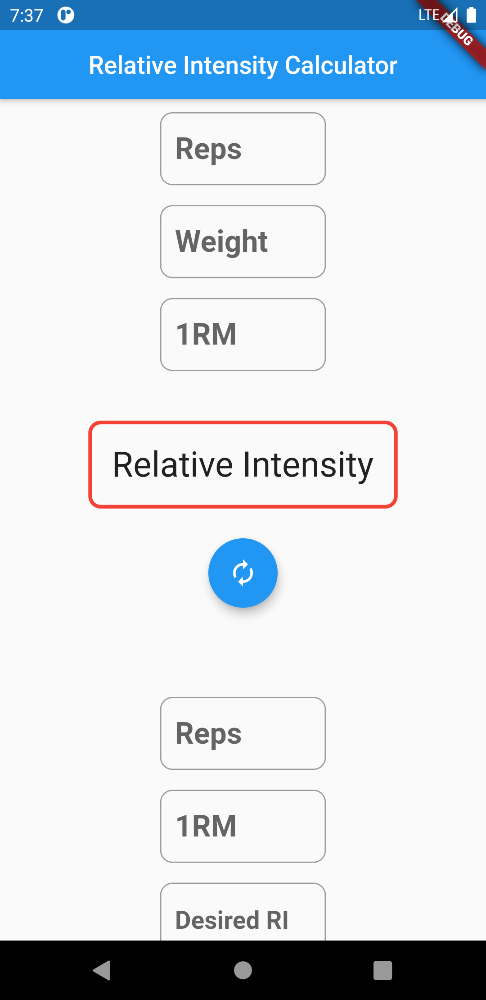

# weight_planner_app
 - the lib for my weight planner application
 - turning my smallscale flask app into a mobile app for android
 - the goal of the project was to branch out into **Backends & Databases** in flutter. Therefore the UI is a bit lacking but it was not the main focus.
   - I decided to go with **Hive** as it is written in dart and made for flutter app dev.
   
   
  
*when trying to work with a flutter project in a github repo on mulitple machines I end up in a sort of dependency hell where one machine can't recognize the dart SDK location if the app was created on a different machine. Luckily just using the lib/ folder contents as a git repo works just fine. Additionally, it slims the repo by ommiting the project files that are pretty much static. The only thing that will need to be kept track of are dependencies and they will be listed below*


### Dependencies (*if any*)

```yaml
environment:
  sdk: ">=2.7.0 <3.0.0"

dependencies:
  flutter:
    sdk: flutter
  hive: ^1.4.4+1
  hive_flutter: ^0.3.1
  path_provider: ^1.6.27


  # The following adds the Cupertino Icons font to your application.
  # Use with the CupertinoIcons class for iOS style icons.
  cupertino_icons: ^1.0.0

dev_dependencies:
  flutter_test:
    sdk: flutter
  hive_generator: ^0.8.2
  build_runner: ^1.10.13
```

### Screen Shots
| image | page |
| --- | ---|
|  | the Max page where you can save & calculate one rep maxes |
|  | adding a new one rep max |
|  | the maxes are stored in a Drawer() that lists them using ListView.Builder() |
|  | the RelativeInt() where you can calculate the relative intensity of a given rep range and determine weight to be used for a desired relative intensity |

*GPLv3*
